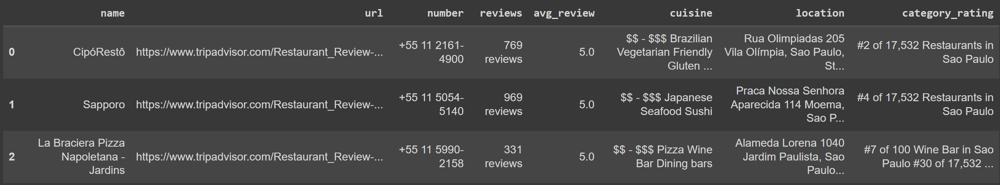

This is the code base used which was used to scrape Trip Advisor to get a full list of restaurants in the Sau Paulo area.

We started off with this initial url: https://www.tripadvisor.com/Restaurants-g303631-Sao_Paulo_State_of_Sao_Paulo.html. From here, we first made a master list of restaurant urls saved in \tripadvisor_scraping\data\urls.csv.

Once we had collated a master list, we went to each website and scraped the following information and put into a csv:

- Restaurant name
- Phone number
- Number of reviews
- Average review
- Cuisine
- Location
- Website
- Total category rating.

An example output of this is the following:

We used Scrapy to quickly and efficiently scrape TripAdvisor using a virtual machine provisioned with Google Compute Engine. Selenium was far too slow and TripAdvisor wouldn't even let the requests module scrape any data.

The full list of restaurants and their information can be found here: data\restaurants_reviews.csv.